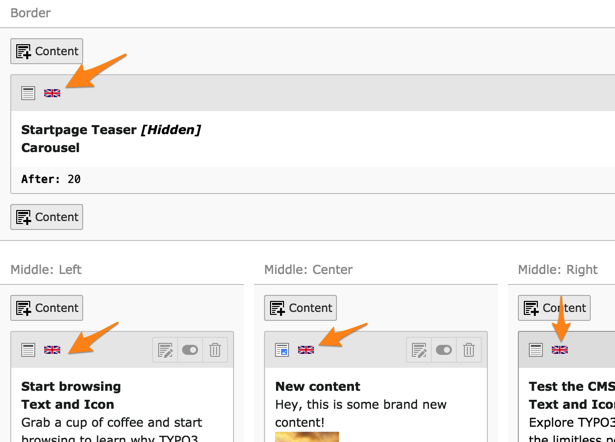

.. include:: ../../Includes.txt

.. _basic-setup-default-language-flag:

Defining the "default" language flag
^^^^^^^^^^^^^^^^^^^^^^^^^^^^^^^^^^^^

As mentioned already, the default language is whatever you
decide it to be. In order to help editors, you can define
a label and a flag for the default language, using TSconfig
placed on the root page of your web site:

.. code-block:: typoscript

      mod.SHARED {
            defaultLanguageFlag = gb
            defaultLanguageLabel = English
      }

This setting is used in particular by the **Web > Page** and the
**Web > List** modules.

   The flag for the default language used in the Web > Page module
