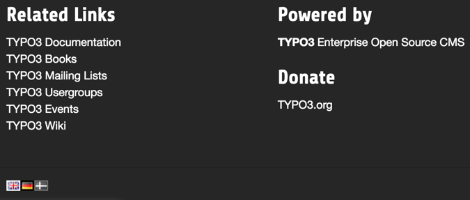

.. include:: ../Includes.txt

.. _language-menu:

=======================
Language selection menu
=======================

To properly navigate a multilingual web site you probably want
to have a language selection menu somewhere. This menu should
show an entry for each possible, with variation of aspect
depending on translation availability, i.e.:

- Translation exists
- Translation exists - currently selected
- Missing translation
- Missing translation - currently selected

This kind of menu can be made by TypoScript and the
:ref:`HMENU content object <t3tsref:cobj-hmenu>`
with special type :ref:`language <t3tsref:hmenu-special-language>`.

Such a menu answers to the above requirements by using four
different item states, respectively "NO", "ACT", "USERDEF1"
and "USERDEF2".

.. _language-menu-tmenu:

TMENU example
=============

The Introduction Package comes with a text-based rendering of the
language menu, located in the footer.

.. figure:: ../Images/LanguageMenuText.png
   :alt: Text-based language menu

   A text-based language menu, with active and disabled states

This is the corresponding code:

.. code-block:: typoscript

   lib.language = COA
   lib.language {
       20 = HMENU
       20 {
           special = language
           special.value = 0,1,2
           special.normalWhenNoLanguage = 0
           wrap =
           1 = TMENU
           1 {
               noBlur = 1
               NO = 1
               NO {
                   doNotLinkIt = 1
                   linkWrap = <li>|</li>
                   stdWrap.override = English || Deutsch || Dansk
                   stdWrap {
                       typolink {
                           parameter.data = page:uid
                           additionalParams = &L=0 || &L=1 || &L=2
                           ATagParams = hreflang="en-GB" || hreflang="de-DE" || hreflang="da-DK"
                           addQueryString = 1
                           addQueryString.exclude = L,id,no_cache
                           addQueryString.method = GET
                           no_cache = 0
                       }
                   }
               }
               ACT < .NO
               ACT.linkWrap = <li class="active">|</li>
               USERDEF1 < .NO
               USERDEF1 {
                   linkWrap = <li class="text-muted">|</li>
                   stdWrap.typolink >
               }
               USERDEF2 < .ACT
               USERDEF2 {
                   linkWrap = <li class="text-muted">|</li>
                   stdWrap.typolink >
               }
           }
       }
       wrap = <ul id="language_menu" class="language-menu">|</ul>
   }

.. hint::

   Having "Page not found (404) trouble?"

   The reason may be a 'cHash' problem.
   See if you can find help in `this discussion
   <https://github.com/dmitryd/typo3-realurl/issues/315>`__. Check whether
   you have 'cHash' in line :ts:`addQueryString.exclude = L,id,no_cache`
   above.

.. _language-menu-gmenu:

GMENU example
=============

It is also possible to go for a graphical rendering, with the
:ref:`GMENU <t3tsref:gmenu>` object, for example to create a menu based
on flag icons. For this, we need to replace the existing code
with something like:

.. code-block:: typoscript

   lib.language.20 >
   lib.language.20 = HMENU
   lib.language.20 {
      special = language
      special.value = 0,1,2
      special.normalWhenNoLanguage = 0
      1 = GMENU
      1.NO {
          XY = [5.w]+4, [5.h]+4
          backColor = black
          5 = IMAGE
          5.file = fileadmin/flags/gb.png  || fileadmin/flags/de.png  || fileadmin/flags/dk.png
          5.offset = 2,2
      }
      1.ACT < .1.NO
      1.ACT = 1
      1.ACT.backColor = white

      1.USERDEF1 < .1.NO
      1.USERDEF1 = 1
      1.USERDEF1.backColor = gray
      1.USERDEF1.10 = EFFECT
      1.USERDEF1.10.value = gray
      1.USERDEF1.noLink = 0

      1.USERDEF2 < .1.USERDEF1
      1.USERDEF2.backColor = green
   }

which will result in:

   A graphical language menu, with active and disabled states
