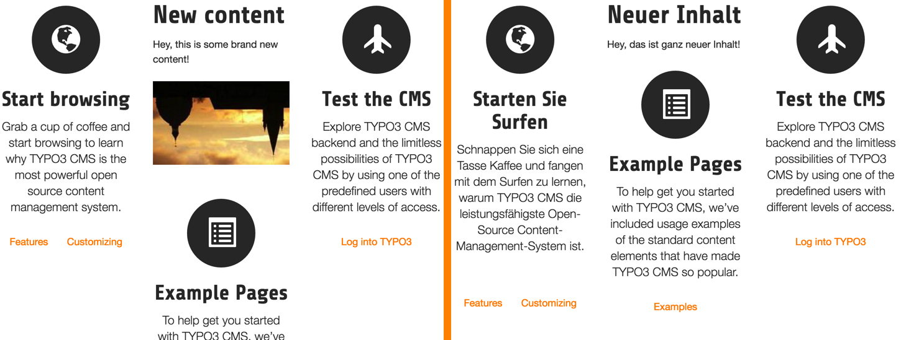
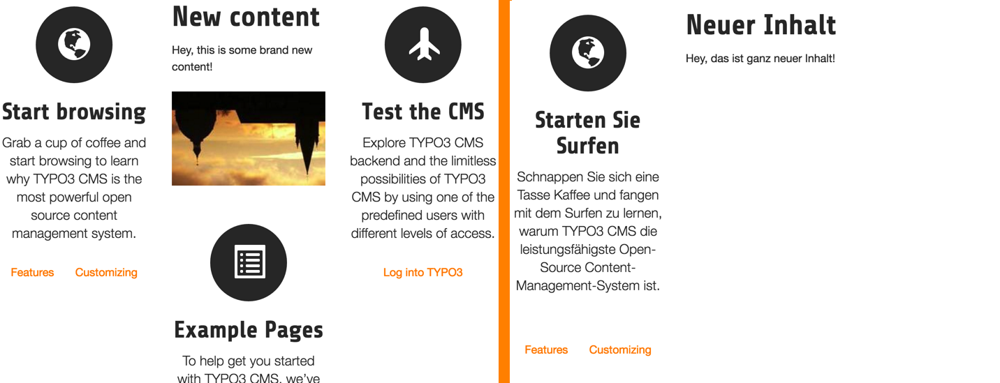
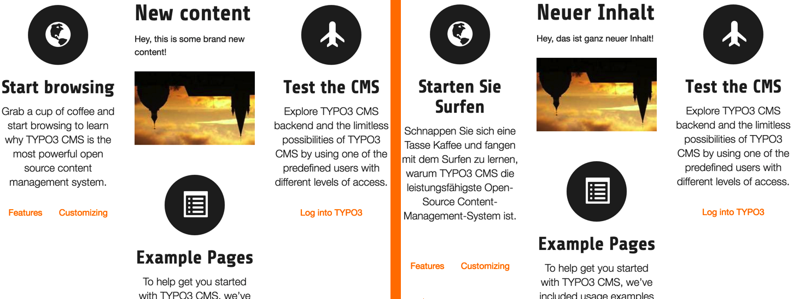
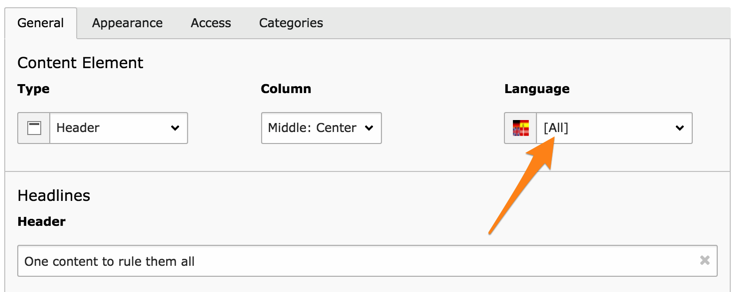
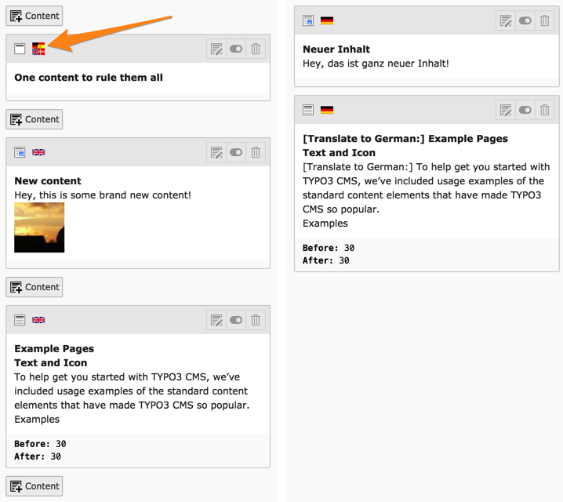

.. include:: ../Includes.txt

.. _localized-content:

Localized content
-----------------

There are two strategies for handling the translation of content on pages:

- If you wish you translate a page 1:1 you might like to using "content
  binding" which secures exactly that. The page's content is then always
  defined by the default language records and any translation is solely
  depending on whether a localized record for the default language
  record exists. This is the least flexible method but leaves less room for errors.

- If you wish to localize a page you can build up a separate set of
  content elements for the page in their own order. You can still
  maintain references between original and translation if you wish. Most
  flexible, but could be too much freedom.

When you start translating a page, the **WEB > Page** module will
ask you about this choice.

.. figure:: ../Images/LocalizedContentTranslationWizard.png
   :alt: The translation wizard showing localization strategies

   The translation wizard asks for a choice of localization strategy

The "Translate" button corresponds to the first way, the "Copy"
button to the second way. Furthers details on how to proceed with
translations are found in the :ref:`Editor's Tutorial <t3editors:languages>`.

.. _localized-content-bound:

Bound content
"""""""""""""

If you opted for the bound content strategy, there are additional
settings to consider. You will want to make sure to have the
following TypoScript defined:

.. code-block:: typoscript

   config.sys_language_overlay = 1

This will force the :ref:`CONTENT content object <t3tsref:cobj-content>`
and the :ref:`RECORDS content object <t3tsref:cobj-records>`
to fetch content elements in the default language first, then
overlay them with the translation.

Associated with :code:`config.sys_language_mode = content_fallback`, this
will produce the following result in the frontend:

   The English version and its German translation, with overlays

The German version is based on the English version. Whatever element was
translated is then overlaid on the English original. If we don't use
overlays, by setting:

.. code-block:: typoscript

   config.sys_language_overlay = 0

the German version will be reduced to the actually translated elements:

   The English version and its German translation, without overlays

.. warning::

   If you want to use the "bound content" paradigm in conjunction with the
   :ref:`"Hide default translation of the page" <localization-overview-hide-default-language>`
   setting, you will need to provide placeholder content elements
   in the default language and translate them, since the whole frontend
   rendering process starts from the default language in such a configuration.

.. _localized-content-fine-tune-overlays:

Refining overlays
"""""""""""""""""

Usage of translation overlays can be further tuned. Fields can be defined
so that overlays happen only if those fields are not empty. This
allows the values of those fields to "float through" the overlay from
the default version into the translated one.

For example, by setting the following TypoScript in case of using
css_styled_content:

.. code-block:: typoscript

   config.sys_language_softMergeIfNotBlank = tt_content:image

or

.. code-block:: typoscript

   config.sys_language_softMergeIfNotBlank = tt_content:assets

in case of using fluid_styled_content, we allow the image
field of the "tt_content" table to be used
in translations if the translation itself does not contain any
images. Assuming we still have :code:`config.sys_language_overlay = 1`,
the result in the frontend will be:

   The English version and its German translation, with merged images

The image from the "New content" content element now appears in
German too, without needing to be explictly defined in the
"Neuer Inhalt" content element.

.. note::

   This merging behaviour can also be defined at field-level using
   TCA.

.. _localized-content-all-language:

The "All" language
""""""""""""""""""

When using overlays, it becomes possible to use a particular
language called "All", which will be automatically visible across all
translations. The uid of that particular language is "-1".

   A content element valid for all languages

It is also marked with the special language icon in the **WEB > Page**
module:

   An "All" language content element displayed in the Web > Page

Note that no "Translate" button appears, the new content element
is valid for all languages.

Unbound contents

In default configuration unbound contents having no related content in default language are not rendered in frontend. To force rendering of these contents you have to define the following TypoScript:

.. code-block:: typoscript

   styles.content.get.select.includeRecordsWithoutDefaultTranslation = 1
   styles.content.getLeft.select.includeRecordsWithoutDefaultTranslation = 1
   styles.content.getRight.select.includeRecordsWithoutDefaultTranslation = 1
