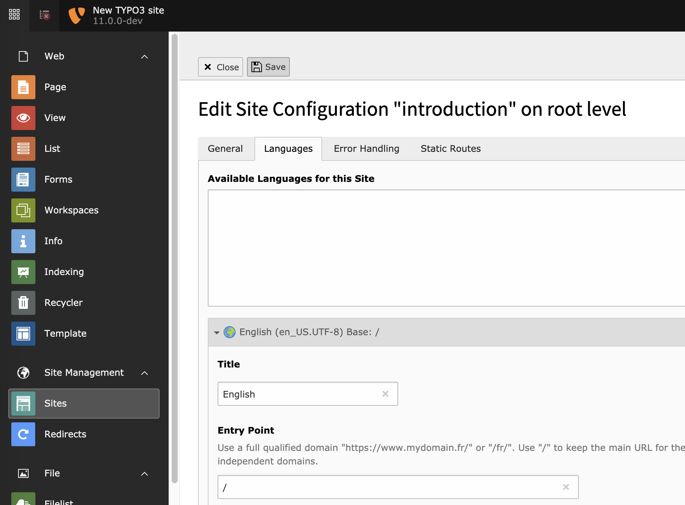

.. include:: ../Includes.txt

.. _languages:

Setting up languages
^^^^^^^^^^^^^^^^^^^^

Languages are defined in the site configuration on a per-rootpage
basis. When creating a new page on root level via TYPO3 Backend,
a very basic site configuration is generated on the fly.
It prevents immediate errors due to missing configuration and can
also serve as a starting point for all further actions.

The Introduction Package's default languages are English, Danish
and German languages. Adding a new language is done in the
"Sites" module in the "Site Management" area of the backend.

   Editing form for a site configuration

.. tip::

   Detailed information on how to extend the site configuration
   with additional languages can be found in the
   :ref:`Site Handling Documentation <coreapi:sitehandling-basics>`.

Once you have defined at least one additional language,
you have the option of translating pages and content.
For example, the **WEB > List** module will show links
for translating, provided you have translated the page
and checked the "Localization view" at the bottom of
the scren.

.. figure:: ../Images/LocalizeLinks.png
   :alt: Content elements with localize links

   The Web > List view, with page translations and localize links for content elements

Translated elements appears nested "under" their default language
parent element in the **WEB > List** view.

.. figure:: ../Images/NestedTranslations.png
   :alt: Nested translations

   The Web > List view shows translations nested under their parent
